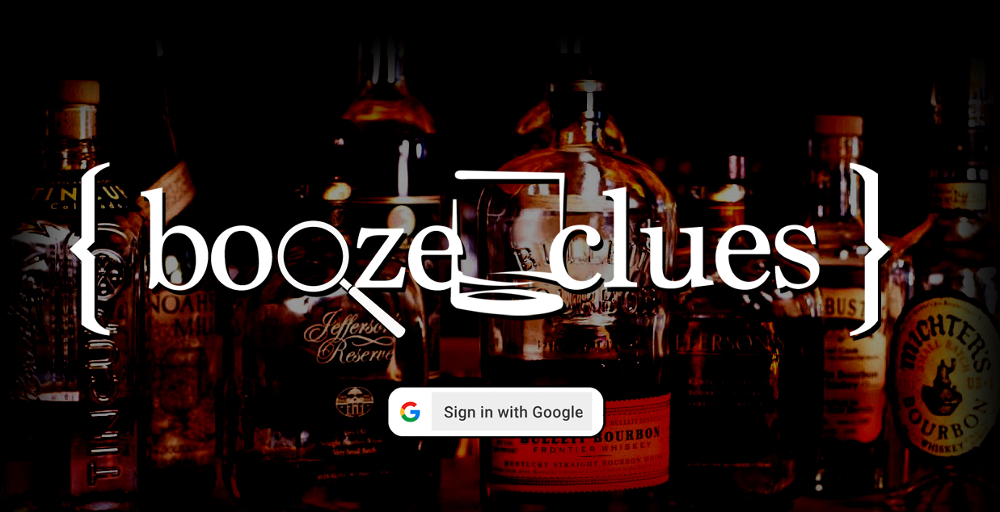
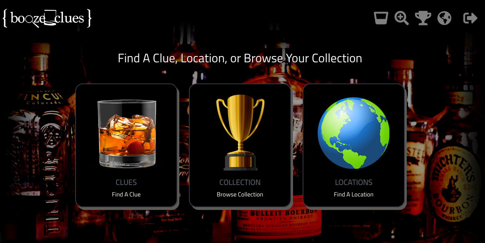

### Booze Clues (Front End Capstone)
This is our Front End Capstone project. My app is called Booze Clues. It is a way for individuals to keep track of specific spirits, wine or beer that they try while enjoying a night out on the town. When you are in the moment of relaxation, hanging with your crew or just getting some me time in, it's easy to not pay attention to what you're drinking. But when you taste that one bottle that you just have to have, I often hear people say.. "I was at this bar the other night and had this bourbon that was excellent, but I can't remember the name?"  Why not create a "Booze Clue" to remind you so that next time you're at that bar or restaurant, you can remember what you had? or take your clue and head to your favorite wine, spirit or craft beer retail store and find the bottle for yourself. Not only just for clues, I also built a way for you to add locations such as distilleries, bars, restaurnts or vacation spots to help you keep track of your favorite watering holes. The app comes pre-populated with the distilleries across the state, but you can add as many as you like, or delete the existing ones. 

## Tech Requirements
* React
* Use Firebase Authentication
* Bootstrap
* Use CRUD to easily add/delete/edit/update Clues/Locations

## Screenshots



## How to run this project:

* Setup Firebase  
  -Create a firebase project  
  -Enable 'Google Authentication'  
  -Create a Firebase Realtime Database  
  -Create an apiKeys.js file (an example file exists in the 'helpers' folder)  

* Clone or download the repo

* Browse to the repo directory in your terminal

* ```npm install``` installs necessary dependencies

* ```npm start``` will run the project at http://localhost:3000